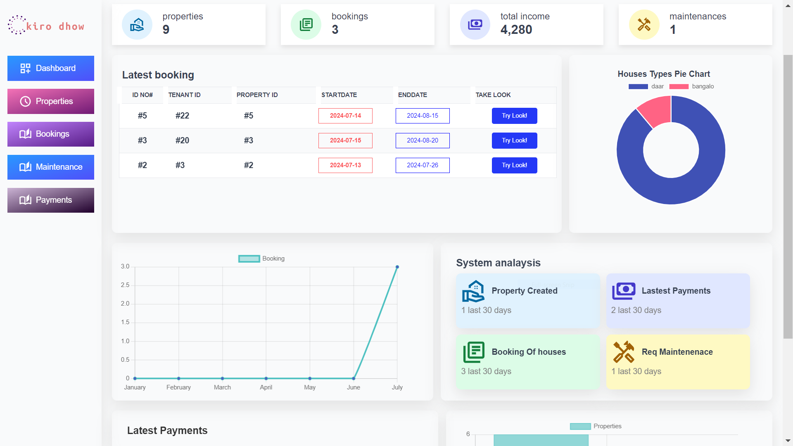

# Kiro Dhow

A comprehensive rental management platform designed to streamline the experience for both landlords and tenants.

## Features

### ✅ User Authentication
- Secure user registration and login for landlords and tenants.
- Robust authentication and authorization mechanisms to protect user data.

### ✅ Property Management
- Landlords can easily add, edit, and delete property listings.
- Detailed property information, including:
  - Address
  - Description
  - Rent amount
  - Available date
  - Amenities and images
- Intuitive search and filter options for tenants to find suitable properties.

### ✅ Tenant Management
- Tenants can search for available properties tailored to their preferences.
- View detailed property information, including images and landlord contact info.
- Option for tenants to request a viewing or inquire about specific properties.

### ✅ Booking and Lease Management
- Seamless booking functionality for tenants to reserve properties.
- Comprehensive lease management features, including:
  - Generation of lease agreements
  - Tracking lease terms
  - Handling renewals or terminations
- Access to resources regarding tenant rights and responsibilities ([Your Renting Rights](https://www.consumer.vic.gov.au/resources-and-tools/other-languages/somali/your-renting-rights)).

### ✅ Payment Integration
- Secure payment processing through a reliable payment gateway for rent payments and booking fees.

### ✅ Notifications
- Timely email or SMS notifications for critical events such as:
  - New property listings
  - Booking requests
  - Lease updates
  - Payment reminders

### ✅ Admin Panel
- Comprehensive admin dashboard for managing users, properties, bookings, and leases.
- Role-based access control for administrators, landlords, and tenants.

### ✅ Reporting
- Basic reporting functionality for landlords to monitor property occupancy, rental income, and other relevant metrics.

### ✅ Responsive Design
- User-friendly and responsive design optimized for both desktop and mobile devices.

### ✅ Testing and Deployment
- Thorough testing to ensure functionality and security.
- Minimum Viable Product (MVP) deployed for public access.

---

We are committed to continuously improving the platform and adding new features to enhance user experience. Your feedback is welcome!